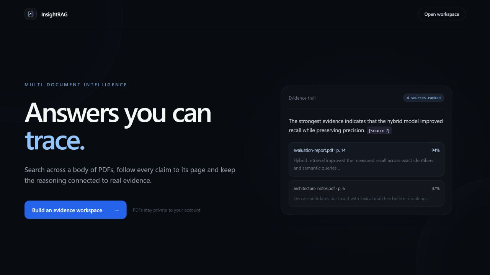
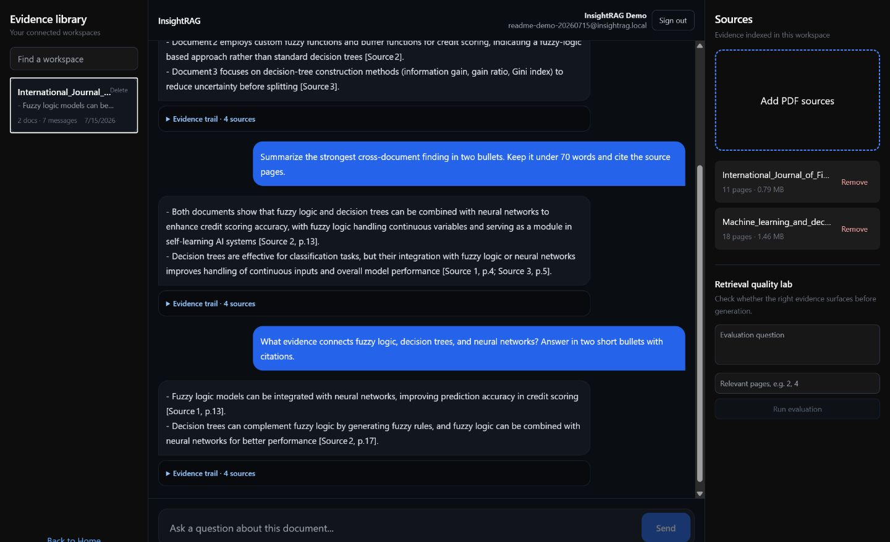
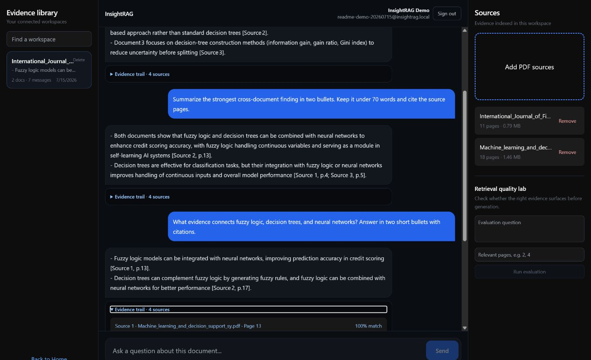
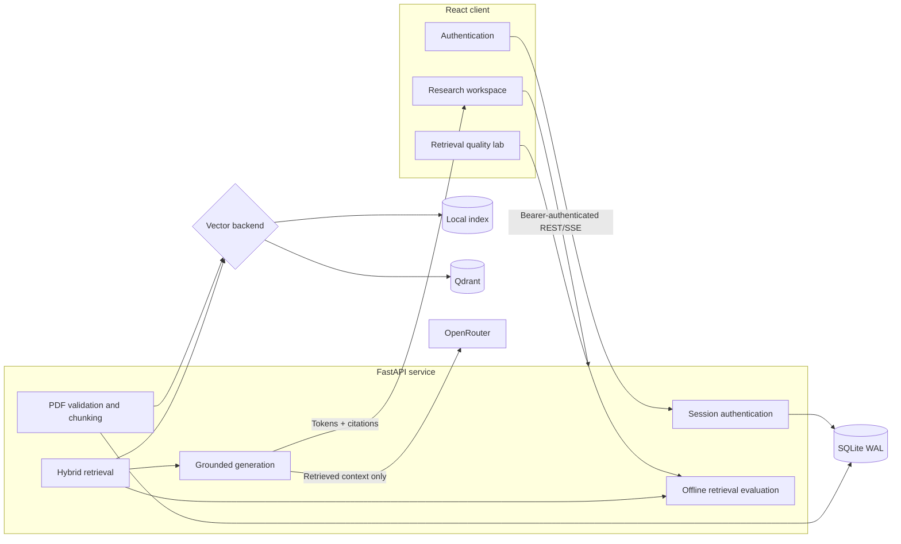

<div align="center">

# InsightRAG

### Multi-document research with answers you can trace back to the page

[](https://github.com/nayana3333/InsightRAG-Multi-Document-Research-Assistant/actions/workflows/ci.yml)


[Repository](https://github.com/nayana3333/InsightRAG-Multi-Document-Research-Assistant) · [Author](https://github.com/nayana3333) · [Local setup](#local-development) · [Architecture](#system-architecture)

</div>

InsightRAG is a multi-tenant Retrieval-Augmented Generation application for researching collections of PDFs. It combines semantic retrieval, lexical matching, rank fusion, optional cross-encoder reranking, streamed generation, and page-level evidence into one workspace.

The project is designed around a practical requirement: a generated answer is only useful when the reader can inspect the evidence behind it.

<p align="center">
  
</p>

## Product walkthrough

### One workspace, multiple documents

Upload related PDFs into a shared workspace, search previous conversations, ask cross-document questions, and manage the indexed source set without leaving the research view.

<p align="center">
  
</p>

### Evidence stays attached to the answer

Each response carries a collapsible evidence trail with the original document name, source page, retrieved excerpt, relevance score, and retrieval signals. The application keeps internal storage identifiers out of the user-facing citation layer.

<p align="center">
  
</p>

## What this project demonstrates

InsightRAG is more than a PDF upload wrapper around an LLM. The repository includes the retrieval, security, persistence, evaluation, and delivery concerns needed to turn a prototype into a credible application.

| Area | Implementation |
|---|---|
| Document ingestion | PDF signature checks, encrypted/damaged document rejection, safe filenames, page and size limits, duplicate detection |
| Retrieval | Dense semantic search + BM25-style lexical scoring + weighted Reciprocal Rank Fusion |
| Reranking | Optional FastEmbed cross-encoder reranking of the fused candidate set |
| Grounding | Evidence-only system prompt, `[Source N]` citations, original filenames, page numbers, snippets, and relevance |
| Generation | OpenRouter chat completions with Server-Sent Events, reasoning controls, provider-error handling, and non-stream fallback |
| Workspaces | Multi-PDF collections, add/remove/reindex flows, search, history, and two-step deletion |
| Authentication | Salted PBKDF2-SHA256 passwords, signed expiring bearer sessions, and tenant-scoped resource access |
| Persistence | SQLite in WAL mode for accounts, workspaces, documents, messages, citations, and evaluation runs |
| Vector storage | Local JSON indexes for simple deployments or Qdrant for persistent vector infrastructure |
| Evaluation | Retrieval Hit Rate@K, Mean Reciprocal Rank, top relevance, page/file-aware test cases |
| Operations | Health/readiness probes, request IDs, latency headers, structured logs, rate limits, Docker, CI/CD |

## System architecture



### Request lifecycle

1. The API validates the PDF signature, page count, encryption state, file size, filename, and content hash.
2. Extracted page text is split into 1,000-character chunks with 200-character overlap. Every chunk retains its document, page, source path, and stable chunk identifier.
3. Semantic and lexical retrievers independently produce candidate rankings.
4. Weighted Reciprocal Rank Fusion combines both rankings; lexical results receive a small boost to preserve exact identifiers and terminology.
5. Up to 12 fused candidates can be reranked by a cross-encoder. The top four chunks become grounded context.
6. OpenRouter streams the answer as SSE events. Sources are emitted before tokens, and the completed answer plus citations is persisted after a successful stream.
7. If a provider returns reasoning events without answer text, InsightRAG retries once through a non-streaming completion path instead of saving an empty response.

## Retrieval design

### Dense retrieval

The default semantic backend uses `BAAI/bge-small-en-v1.5` through FastEmbed. Qdrant collections store embedding-model metadata, so an incompatible model change triggers a safe index rebuild instead of mixing vector spaces.

For constrained local environments where the ONNX runtime is unavailable, the application falls back to deterministic hash embeddings. That keeps development and tests operational while preserving the semantic backend for Linux and container deployments.

### Lexical retrieval

The lexical path uses BM25-style term scoring. It complements dense retrieval for:

- model names and technical abbreviations;
- policy or document identifiers;
- exact numeric and domain-specific terms;
- phrases whose lexical form is more important than semantic similarity.

### Rank fusion and reranking

InsightRAG retrieves at least 20 candidates from each path and combines them with weighted RRF:

```text
fused_score(document) = Σ weight / (60 + rank)
```

Dense results use a weight of `1.0`; lexical results use `1.15`. The best 12 fused chunks are eligible for cross-encoder reranking before the final top-K selection.

### Grounded answer contract

The generation prompt enforces three rules:

- answer only from retrieved evidence;
- cite factual claims using `[Source N]`;
- say the answer is unknown when the evidence does not support it.

The client receives the answer and its evidence separately, allowing citations to remain inspectable without mixing retrieval metadata into the prose.

## Retrieval evaluation

The quality lab evaluates retrieval without calling the LLM, which makes experiments repeatable and inexpensive. A case can specify expected pages and, when multiple PDFs contain similar pagination, expected filenames.

```json
{
  "k": 4,
  "cases": [
    {
      "question": "Which model is compared with logistic regression?",
      "relevantPages": [3, 4],
      "relevantFiles": ["credit-risk-study.pdf"]
    }
  ]
}
```

Reported metrics:

| Metric | Meaning |
|---|---|
| Hit Rate@K | Fraction of cases where a relevant source appears in the top K |
| Mean Reciprocal Rank | Rewards the first relevant source appearing near the top |
| Average top relevance | Mean normalized relevance of the highest-ranked result |

Evaluation runs are tenant-scoped and persisted for later comparison.

## Security and reliability

### Identity and tenant isolation

- Passwords use PBKDF2-HMAC-SHA256 with a unique random salt and 310,000 iterations.
- Sessions are HMAC-SHA256 signed, expire after 24 hours by default, and are revalidated against the user table.
- Every workspace, document, message, deletion, and evaluation query includes the authenticated owner ID.
- Cross-tenant resource lookups return `404`, avoiding identifier disclosure.

### Input and API controls

- PDF magic-byte, extension, encryption, corruption, size, and page-count validation.
- SHA-256 duplicate detection within each workspace.
- Configurable maximums: 15 MB per PDF, 500 pages per PDF, and 20 documents per workspace.
- Sliding-window limits for registration, login, upload, and generation routes.
- Restricted CORS methods and headers; secrets remain server-side.
- Request IDs, processing-time headers, cached provider checks, and structured request logs.
- Separate `/health/live` and `/health/ready` probes for orchestration.

### Data sent to the model provider

The OpenRouter API key never reaches the browser. For generation, the backend sends the conversation and retrieved context required to answer the question. Teams handling confidential data should configure an approved provider and retention policy before production use.

## Technology stack

| Layer | Technology |
|---|---|
| Frontend | React 19, React Router, Tailwind CSS, Vite |
| API | FastAPI, Pydantic, Uvicorn |
| RAG orchestration | LangGraph, LangChain document/message primitives |
| PDF processing | pypdf |
| Embeddings and reranking | FastEmbed, BGE small, MiniLM cross-encoder |
| LLM gateway | OpenRouter |
| Application database | SQLite with WAL mode and automatic migrations |
| Vector database | Qdrant or local persisted index |
| Testing | pytest/unittest, Playwright |
| Delivery | Docker Compose, Nginx, GitHub Actions, GHCR, Render Blueprint |

## Local development

### Prerequisites

- Python 3.12+
- Node.js 22+
- An OpenRouter API key
- Docker Desktop only if using Qdrant/Compose

### 1. Clone the repository

```bash
git clone https://github.com/nayana3333/InsightRAG-Multi-Document-Research-Assistant.git
cd InsightRAG-Multi-Document-Research-Assistant
```

### 2. Create the backend environment

Windows PowerShell:

```powershell
python -m venv .venv
.\.venv\Scripts\python.exe -m pip install -r Backend\requirements.txt
Copy-Item Backend\.env.example Backend\.env
```

macOS/Linux:

```bash
python3 -m venv .venv
./.venv/bin/python -m pip install -r Backend/requirements.txt
cp Backend/.env.example Backend/.env
```

Set at least these values in `Backend/.env`:

```env
OPENROUTER_API_KEY=replace_with_your_private_key
OPENROUTER_MODEL=openrouter/free
AUTH_SECRET=replace_with_at_least_32_random_characters
VECTOR_BACKEND=local
```

Generate a strong authentication secret instead of using the example value.

### 3. Install the frontend

```bash
cd Frontend
npm ci
cd ..
```

### 4. Run both services

Backend:

```powershell
cd Backend
..\.venv\Scripts\python.exe -m uvicorn main:app --host 127.0.0.1 --port 8000
```

Frontend, in another terminal:

```bash
cd Frontend
npm run dev -- --host 127.0.0.1 --port 5173
```

Open [http://127.0.0.1:5173](http://127.0.0.1:5173). Interactive API documentation is available at [http://127.0.0.1:8000/docs](http://127.0.0.1:8000/docs).

## Configuration reference

| Variable | Default | Purpose |
|---|---:|---|
| `OPENROUTER_API_KEY` | required | Server-side provider credential |
| `OPENROUTER_MODEL` | `openrouter/free` | OpenRouter model or router ID |
| `AUTH_SECRET` | required | Signs bearer sessions; use 32+ random characters |
| `AUTH_TOKEN_TTL_HOURS` | `24` | Session lifetime |
| `VECTOR_BACKEND` | `local` | `local` or `qdrant` |
| `QDRANT_URL` | `http://127.0.0.1:6333` | Qdrant REST endpoint |
| `QDRANT_API_KEY` | empty | Required for authenticated Qdrant deployments |
| `EMBEDDING_BACKEND` | `semantic` | `semantic` or deterministic `hash` fallback |
| `EMBEDDING_MODEL` | `BAAI/bge-small-en-v1.5` | FastEmbed model |
| `RERANKER_MODEL` | `Xenova/ms-marco-MiniLM-L-6-v2` | Optional cross-encoder |
| `RAGFLOW_DB_PATH` | `Backend/ragflow.db` | SQLite database location |
| `CORS_ORIGINS` | local Vite origins | Comma-separated allowed frontend origins |
| `MAX_FILE_SIZE_MB` | `15` | Per-file upload limit |
| `MAX_PDF_PAGES` | `500` | Per-file page limit |
| `MAX_WORKSPACE_DOCUMENTS` | `20` | Documents per workspace |
| `RATE_LIMIT_ENABLED` | `true` | Enables in-process sliding-window limits |
| `VITE_API_URL` | `/api` | Frontend API base URL |

## Docker deployment

Copy and configure the environment file first, then run:

```bash
docker compose up --build
```

Services:

| Service | Local address | Role |
|---|---|---|
| Frontend | `http://localhost:8080` | Nginx-served React application and `/api` proxy |
| Backend | `http://127.0.0.1:8000` | FastAPI service |
| Qdrant | `http://127.0.0.1:6333` | Vector database and local dashboard |

Compose persists uploads, application data, vectors, model cache, and Qdrant storage in named volumes. Published ports bind to loopback by default.

## API overview

| Method | Endpoint | Purpose |
|---|---|---|
| `POST` | `/auth/register` | Create an account and issue a session |
| `POST` | `/auth/login` | Authenticate an existing account |
| `GET` | `/auth/me` | Validate the current session |
| `GET` | `/health`, `/health/live`, `/health/ready` | Service and dependency health |
| `GET` | `/configuration` | Provider and model readiness |
| `POST` | `/chats` | Create a workspace from the first PDF |
| `GET` | `/chats` | List tenant-scoped workspaces |
| `GET`, `POST` | `/chats/{chatId}/documents` | List or add documents |
| `DELETE` | `/chats/{chatId}/documents/{documentId}` | Remove a document and rebuild the index |
| `GET` | `/chats/{chatId}/messages` | Load conversation and citation history |
| `POST` | `/chats/{chatId}/messages/stream` | Stream a grounded answer over SSE |
| `DELETE` | `/chats/{chatId}` | Delete a workspace, files, and vector index |
| `POST` | `/chats/{chatId}/evaluations` | Run a retrieval benchmark |
| `GET` | `/evaluations` | List saved evaluation runs |

## Testing and quality gates

The repository currently contains 15 backend tests and one full browser workflow covering registration, multi-document ingestion, streaming, citations, removal, and responsive workspace behavior.

```powershell
# Backend
.\.venv\Scripts\python.exe -m pytest Backend\tests -q

# Frontend
cd Frontend
npm run lint
npm run build
npm run test:e2e

# Containers
cd ..
docker compose config --quiet
docker compose build
```

GitHub Actions runs backend tests, frontend lint/build/E2E checks, and container validation on pushes and pull requests. Version tags publish `insight-rag-api` and `insight-rag-web` images to GitHub Container Registry.

## Repository structure

```text
InsightRAG-Multi-Document-Research-Assistant/
├── Backend/
│   ├── main.py                 # API routes, validation, streaming, health
│   ├── charbot.py              # ingestion, retrieval, reranking, generation
│   ├── database.py             # SQLite schema, migrations, tenant queries
│   ├── auth.py                 # password hashing and signed sessions
│   ├── evaluation.py           # Hit Rate@K and MRR evaluation
│   ├── security.py             # sliding-window rate limiter
│   ├── tests/                  # backend regression tests
│   └── scripts/                # end-to-end API smoke tooling
├── Frontend/
│   ├── src/                    # React application
│   ├── e2e/                    # Playwright workflow
│   ├── nginx.conf              # SPA hosting, API proxy, security headers
│   └── Dockerfile
├── docs/images/                # authentic application screenshots
├── .github/workflows/          # CI and container publishing
├── docker-compose.yml
├── render.yaml
└── README.md
```

## Deployment notes

`render.yaml` provides a starting Blueprint for a Render deployment. The frontend is deployed as a static Vite site and the API as a Docker service with a persistent disk.

Before deploying:

1. rotate any key that has been shared outside your secret manager;
2. set `OPENROUTER_API_KEY` and a generated `AUTH_SECRET` as secrets;
3. set `CORS_ORIGINS` to the exact deployed frontend origin;
4. set `VITE_API_URL` to the deployed API URL;
5. use Qdrant Cloud or another persistent Qdrant deployment for horizontally scaled workloads.

The local vector backend is appropriate for a single-instance demonstration. A production rollout should also move rate-limit state to Redis and application data to a managed relational database.

## Engineering trade-offs

- **SQLite instead of PostgreSQL:** keeps local setup and portfolio evaluation simple while preserving a clear migration path through the database boundary.
- **Synchronous PDF indexing:** reduces operational dependencies for a demonstration; large production workloads should move ingestion to a durable job queue.
- **Local or Qdrant vectors:** supports a zero-infrastructure mode without hiding the scalable deployment path.
- **OpenRouter gateway:** makes model selection configurable and keeps provider credentials out of the browser.
- **Explicit retrieval evaluation:** measures the component that determines grounding quality without conflating it with LLM style.

## Roadmap

- OCR for scanned and image-only PDFs
- background ingestion jobs with progress events
- Redis-backed distributed rate limiting
- PostgreSQL for multi-instance application persistence
- reranking and chunking experiments tracked across evaluation datasets
- shareable read-only research reports with citation deep links

## Contributing and security

Development and pull-request expectations are documented in [CONTRIBUTING.md](CONTRIBUTING.md). Please report vulnerabilities through the private process described in [SECURITY.md](SECURITY.md), not through a public issue.

## Author

Built and maintained by [Nayana](https://github.com/nayana3333).

If this repository is useful, open an issue with a reproducible case or start a discussion with the retrieval behavior you would like to evaluate.
